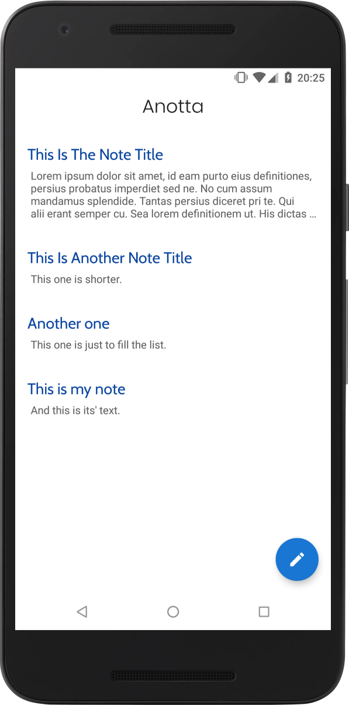

# Anotta
Another Note-Taking App

## Goal
The goal is, as always with note-taking apps, to exercise design. In this case, it is meant to adhere to "Material Theming" redesign of Android (Started with Android 9.0 Pie), and is inspired by "whitespace" theme of Google apps.

## Synopsis
All of the notes are stored in the local database, using the [Room Android Architecture Component](https://developer.android.com/topic/libraries/architecture/room), and the Room implementation is modeled after [Android Room With A View codelab](https://codelabs.developers.google.com/codelabs/android-room-with-a-view/). At runtime, they are kept within a [ViewModel](https://developer.android.com/jetpack/arch/viewmodel), to survive configuration changes. They are displayed in a RecyclerView, within CoordinatorLayout (to coordinate and animate views, such as the FAB).

## State
The app is currently functional in a sense that you can add, edit and delete notes with it. However, it still doesn't have the polished experience I'm striving for.

## Building
Clone the repository (from Android Studio directly, or by git commands), and build it like a regular Android Studio project. There shouldn't be issues, except if you have to download the latest libraries, however, if there are issues, report them.
